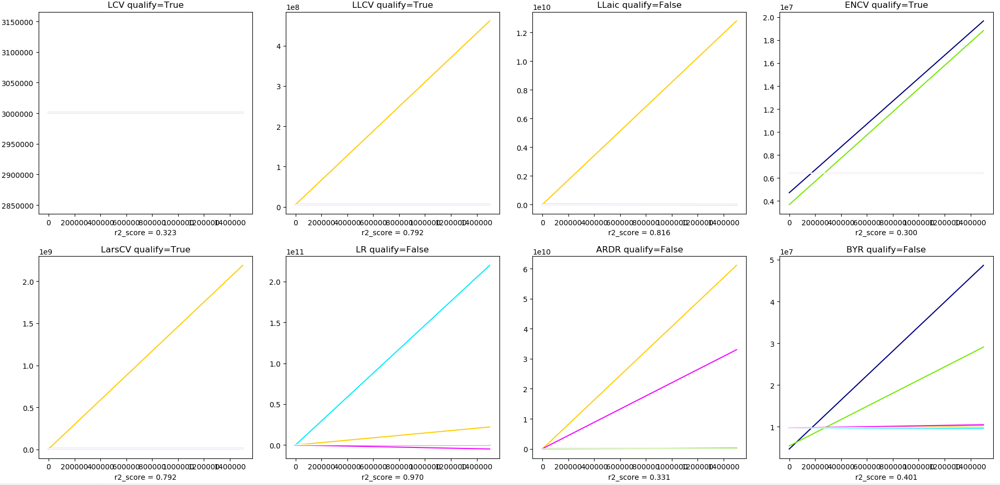

# mkt_mix_model
an MVP for a MMM in a online store

# dependencies 
 - pandas 
 - python = 3.7
 - matplotlib 
 - numpy
 - sklearn

# algorithm description
using sklearn `lineal_model` library, select and fit a list of models. Given a monotonicity criterion over the predictions of each model, the algorithm select some models that qualify with the criterion and create an assembly model. This assembly model has a unified prediction method that uses CV score to build a "voted" prediction with all qualified models. 
This Assembly Model should have a more stable prediction than each individual model.  

